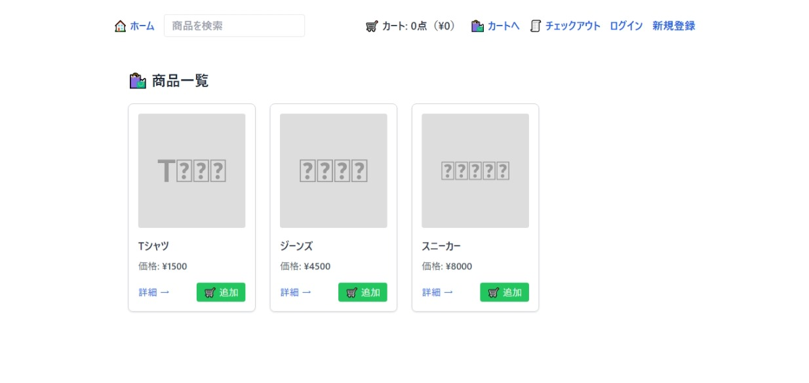

# 🛍 Simple Shopping Cart App

このプロジェクトは、ショッピングカートアプリのフロントエンドです。
バックエンド API と連携し、商品一覧・詳細・カート・チェックアウト・ログイン機能を提供します。

---

## 🚀 使用技術

- [React](https://reactjs.org/)
- [TypeScript](https://www.typescriptlang.org/)
- [React Router](https://reactrouter.com/)
- [Tailwind CSS](https://tailwindcss.com/)
- [Context API](https://reactjs.org/docs/context.html)

---

## 🖼️ アプリの画面例



## 📁 フォルダ構成

src/ 
├── components/ # UIコンポーネント群
│ ├── ProductList.tsx
│ ├── ProductDetail.tsx
│ ├── Cart.tsx
│ |── Checkout.tsx
| └── ProtectedRoute.tsx
├── context/ # グローバル状態管理（Context）
│ ├── CartContext.tsx
│ └── UserContext.tsx
├── data/ # 商品データと型定義
│ └── data.ts
│── pages
│ │── Login.css
│ │── Login.tsx
│ └── Register.tsx
├── App.tsx # ルーティングとレイアウト
├── index.js # エントリーポイント
└── index.css

## 📦 セットアップ手順

```bash
# リポジトリをクローン
git clone https://github.com/kazu-b157ztomu/shopping-cart-app.git
cd shopping-cart-frontend

# 依存関係をインストール
npm install

# 開発サーバーを起動
npm start


🧪 主な機能
・商品一覧表示

・商品詳細ページ

・カートへの追加・削除・数量変更

・合計金額の計算

・チェックアウトフォーム（バリデーション付き）

・ログイン機能

・グローバルなカート状態管理（Context API）

📄 ライセンス
MIT License

🙌 作者
Created by kazu-b157ztomu